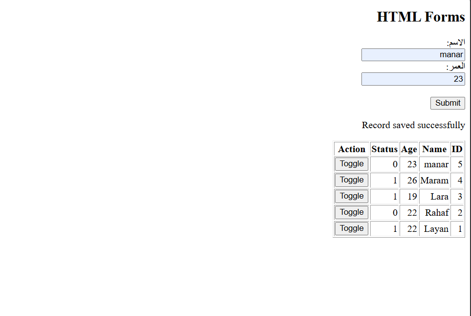
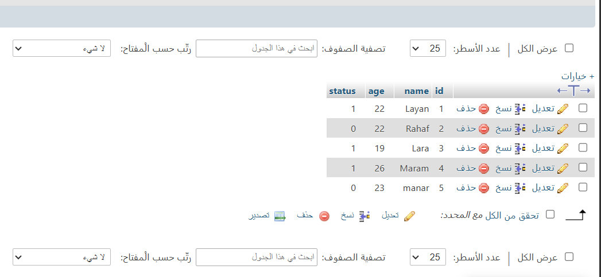

# web-dynamic-user-task

## Overview
This project is a dynamic web application built using HTML, JavaScript (Fetch API), PHP, and a MySQL database hosted on InfinityFree. The system allows users to view, add, and update records seamlessly without requiring a page refresh.

---

## Features
- Dynamic Data Display: Fetches and displays user data (`id`, name, age, `status`) from the MySQL database on page load.
- Asynchronous Data Insertion: Allows users to submit new entries through an HTML form using the Fetch API without refreshing the browser.
- Instant Status Toggle: Toggle user status values (`0` or `1`) dynamically with real-time database synchronization.
- Responsive Layout: Simple and structured interface for smooth interactions.

---

## Project Structure
- index.html - The main interface containing the HTML form, data table, and JavaScript logic for handling asynchronous requests.
- config.php - Holds the database connection credentials and handles connection error checks.
- list.php - Retrieves user records from the MySQL database and returns them in JSON format.
- save.php - Processes incoming POST requests to insert new user records into the database.
- toggle.php - Handles status update requests and toggles values directly in the database.

---

## Database Configuration
The application connects to a MySQL database with a table structured as follows:

```sql
CREATE TABLE user (
  id INT(11) NOT NULL AUTO_INCREMENT,
  name VARCHAR(255) NOT NULL,
  age INT(11) NOT NULL,
  status TINYINT(1) DEFAULT 0,
  PRIMARY KEY (`id`)
\ENGINE=InnoDB DEFAULT CHARSET=utf8mb4;)
```


How It Works
1. Initial Load: When ⁠index.html⁠ loads, a JavaScript ⁠fetch()⁠ request calls ⁠list.php⁠ to fetch all current records from the database and populate the table.
2. Adding Users: Submitting the form triggers an asynchronous POST request to ⁠save.php⁠, inserting the record into the database and immediately updating the UI table.
3. Toggling Status: Clicking the status button triggers ⁠toggle.php⁠ to update the selected record's ⁠status⁠ value in the database instantly.
Screenshot:
### 1. Web Application Interface


### 2. MySQL Database Table Structure & Data



